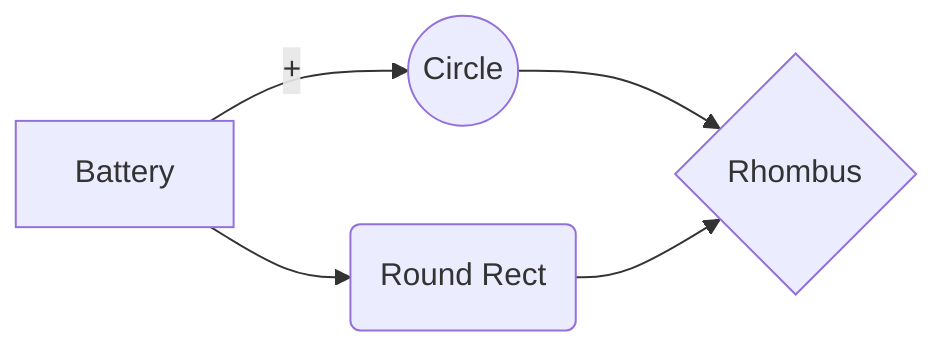


# Cars

## Electrical Components

One challenge was making the cars small enough so that we can have multiple ones driving on the same circuit while still having a fast and precise drive. For that, we decided to use basic but effective electronic components. The list of the components used for each car is as follows:

>- [ESP8266 board](https://www.conrad.ch/fr/p/carte-de-developpement-sbc-nodemcu-esp8266-1613301.html)
>- [ESP32-CAM board](https://www.conrad.ch/fr/p/joy-it-sbc-esp32-cam-module-camera-1-pc-s-2332111.html?gclid=EAIaIQobChMIupPEp_an_wIVFwSLCh3cpACiEAQYBCABEgKRkvD_BwE&utm_source=google-shopping-fr&utm_medium=search&utm_campaign=shopping-online-fr&utm_content=shopping-ad_cpc&WT.srch=1&ef_id=EAIaIQobChMIupPEp_an_wIVFwSLCh3cpACiEAQYBCABEgKRkvD_BwE%3AG%3As)
>- [L298N motor driver](https://www.conrad.ch/fr/p/joy-it-motormodul-2-u-4-phasen-6-bis-12v-carte-de-developpement-1573541.html?utm_source=google-shopping-fr&utm_medium=search&utm_campaign=shopping-online-fr&utm_content=shopping-ad_cpc&WT.srch=1&ef_id=EAIaIQobChMIhq2tifen_wIVz_dRCh251QydEAQYASABEgK3X_D_BwE%3AG%3As&gclid=EAIaIQobChMIhq2tifen_wIVz_dRCh251QydEAQYASABEgK3X_D_BwE)
>- External antenna [(connector](https://www.digitec.ch/fr/s1/product/delock-cable-dantenne-sma-mhf-4-20cm-pour-linstallation-cable-dantenne-cable-dantenne-13123653?dbq=1&gclid=EAIaIQobChMIw-aUuPan_wIV1Pl3Ch0ynAiqEAQYBSABEgKyePD_BwE&gclsrc=aw.ds) & [antenna)](https://www.play-zone.ch/en/wlan-wifi-antenne-2-4ghz-mit-knickgelenk-sma-male.html?gad=1&gclid=EAIaIQobChMIw-aUuPan_wIV1Pl3Ch0ynAiqEAQYAyABEgJRwvD_BwE&___from_store=de)
>- [Motor](https://www.conrad.ch/fr/p/joy-it-com-motor01-moto-reducteur-jaune-noir-adapte-pour-ordinateur-monocarte-arduino-banana-pi-cubieboard-raspber-1573543.html)
>- [Servo](https://www.conrad.ch/fr/p/reely-mini-servomoteur-analogique-materiau-entrainement-plastique-systeme-de-connecteur-jr-2148502.html?gclid=EAIaIQobChMI8rjYpbj3_QIVkeR3Ch2lFAX7EAQYASABEgKR8_D_BwE&utm_source=google-shopping-fr&utm_medium=search&utm_campaign=shopping-online-fr&utm_content=shopping-ad_cpc&WT.srch=1&ef_id=EAIaIQobChMI8rjYpbj3_QIVkeR3Ch2lFAX7EAQYASABEgKR8_D_BwE%3AG%3As)
>- [Color sensor](https://www.conrad.ch/de/p/joy-it-sen-color-arduino-erweiterungs-platine-schwarz-passend-fuer-einplatinen-computer-arduino-1-st-1503748.html?gclid=EAIaIQobChMIocb197v3_QIVl7PVCh0icgzwEAQYASABEgIbVfD_BwE&utm_source=google-shopping-de&utm_medium=search&utm_campaign=shopping-online-de&utm_content=shopping-ad_cpc&WT.srch=1&ef_id=EAIaIQobChMIocb197v3_QIVl7PVCh0icgzwEAQYASABEgIbVfD_BwE%3AG%3As)
>- [Lipo battery](https://www.conrad.ch/fr/p/pack-de-batterie-lipo-7-4-v-1000-mah-conrad-energy-1344143-25-c-softcase-fiche-bec-femelle-1344143.html)

The ESP8266 board was used to connect every other component and to make a connection to the server used to control the cars while the ESP32-CAM board was used to stream the point of view of each car on a dedicated server.

## Connections and circuitry 

The electrical components were connected as follows:

