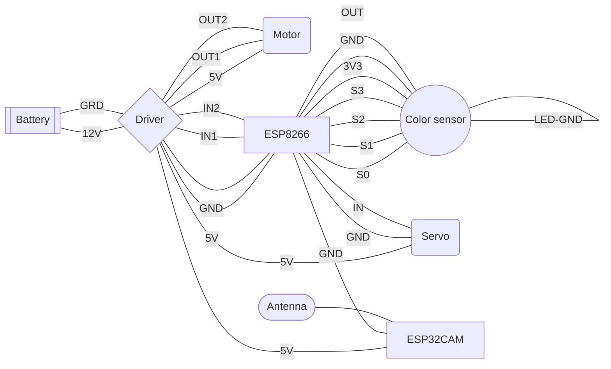

# Cars

## Electrical Components

One challenge was making the cars small enough so that we can have multiple ones driving on the same circuit while still having a fast and precise drive. For that, we decided to use basic but effective electronic components. The list of the components used for each car is as follows:

>- [ESP8266 board](https://www.conrad.ch/fr/p/carte-de-developpement-sbc-nodemcu-esp8266-1613301.html)
>- [ESP32-CAM board](https://www.conrad.ch/fr/p/joy-it-sbc-esp32-cam-module-camera-1-pc-s-2332111.html?gclid=EAIaIQobChMIupPEp_an_wIVFwSLCh3cpACiEAQYBCABEgKRkvD_BwE&utm_source=google-shopping-fr&utm_medium=search&utm_campaign=shopping-online-fr&utm_content=shopping-ad_cpc&WT.srch=1&ef_id=EAIaIQobChMIupPEp_an_wIVFwSLCh3cpACiEAQYBCABEgKRkvD_BwE%3AG%3As)
>- [L298N motor driver](https://www.conrad.ch/fr/p/joy-it-motormodul-2-u-4-phasen-6-bis-12v-carte-de-developpement-1573541.html?utm_source=google-shopping-fr&utm_medium=search&utm_campaign=shopping-online-fr&utm_content=shopping-ad_cpc&WT.srch=1&ef_id=EAIaIQobChMIhq2tifen_wIVz_dRCh251QydEAQYASABEgK3X_D_BwE%3AG%3As&gclid=EAIaIQobChMIhq2tifen_wIVz_dRCh251QydEAQYASABEgK3X_D_BwE)
>- External antenna [(connector](https://www.digitec.ch/fr/s1/product/delock-cable-dantenne-sma-mhf-4-20cm-pour-linstallation-cable-dantenne-cable-dantenne-13123653?dbq=1&gclid=EAIaIQobChMIw-aUuPan_wIV1Pl3Ch0ynAiqEAQYBSABEgKyePD_BwE&gclsrc=aw.ds) & [antenna)](https://www.play-zone.ch/en/wlan-wifi-antenne-2-4ghz-mit-knickgelenk-sma-male.html?gad=1&gclid=EAIaIQobChMIw-aUuPan_wIV1Pl3Ch0ynAiqEAQYAyABEgJRwvD_BwE&___from_store=de)
>- [Motor](https://www.conrad.ch/fr/p/joy-it-com-motor01-moto-reducteur-jaune-noir-adapte-pour-ordinateur-monocarte-arduino-banana-pi-cubieboard-raspber-1573543.html)
>- [Servo](https://www.conrad.ch/fr/p/reely-mini-servomoteur-analogique-materiau-entrainement-plastique-systeme-de-connecteur-jr-2148502.html?gclid=EAIaIQobChMI8rjYpbj3_QIVkeR3Ch2lFAX7EAQYASABEgKR8_D_BwE&utm_source=google-shopping-fr&utm_medium=search&utm_campaign=shopping-online-fr&utm_content=shopping-ad_cpc&WT.srch=1&ef_id=EAIaIQobChMI8rjYpbj3_QIVkeR3Ch2lFAX7EAQYASABEgKR8_D_BwE%3AG%3As)
>- [Color sensor](https://www.conrad.ch/de/p/joy-it-sen-color-arduino-erweiterungs-platine-schwarz-passend-fuer-einplatinen-computer-arduino-1-st-1503748.html?gclid=EAIaIQobChMIocb197v3_QIVl7PVCh0icgzwEAQYASABEgIbVfD_BwE&utm_source=google-shopping-de&utm_medium=search&utm_campaign=shopping-online-de&utm_content=shopping-ad_cpc&WT.srch=1&ef_id=EAIaIQobChMIocb197v3_QIVl7PVCh0icgzwEAQYASABEgIbVfD_BwE%3AG%3As)
>- [7.4V Lipo battery](https://www.conrad.ch/fr/p/pack-de-batterie-lipo-7-4-v-1000-mah-conrad-energy-1344143-25-c-softcase-fiche-bec-femelle-1344143.html)

The ESP8266 board was used to connect every other component and to make a connection to the server used to control the cars while the ESP32-CAM board was used to stream the point of view of each car on a dedicated server.

## Connections and circuitry 

The electrical components were connected as follows:

## Color sensor calibration

The color sensor being sensible to the lightning conditions and itss distance to its target, it needed to be calibrated to be as precise as possible. The code of the calibration is available on the repo.

A dediacated server was made at the beginning of testing and showed the performace of the sensor as seen below.

https://github.com/albertfares/MIT/assets/91048303/5f766e19-ce79-4871-9765-ed46f7992c80

# Circuit

## Design

The design of the circuit was made using Fusion360.
The main design of the circuit is shown below.

We then chose to laser cut the circuit on 3mm MDF boards, so we had to make a puzzle like design for both cutting and easier transportation and storage. The full .dxf file is included in the repo.

The laser cutting used aprox. 3 1.6x2m boards.

The final circuit looked like this:

# Phone Holder

## MDF structure

To hold the iPhone used to track the cars 3 meters above the ground, we had to be creative and make a phone holder that was attached to the railing of the DLL's first floor. The structure was laser-cut on 1cm MDF boards and was designed on FUSION 360 (.dxf design file available on the repo).
To make the phone holder strong and reliable, a puzzle-like design was used between pieces and the connections were strenghened by wood glue.

## 3D printed holder

To hold the iPhone in place, a custom designed holder was 3D printed and mounted on the MDF structure. 
The .f3d file available on the repo was made for an iPhone 14 Pro Max.

# Car's view point

## Streaming server

To stream each car's pov, we used an esp32 cam on each car which streams continually on a custom server. The code used to enable the streaming on the boards allows to chose the quality and format of the video output. We personally went with the SVGA format and a quality of 63 (to have a fluid stream). All the videos are then combined on a streaming server which can handle up to 6 cars' povs. The code for the server and the html design are both on the repo.

It looked like this:

 
